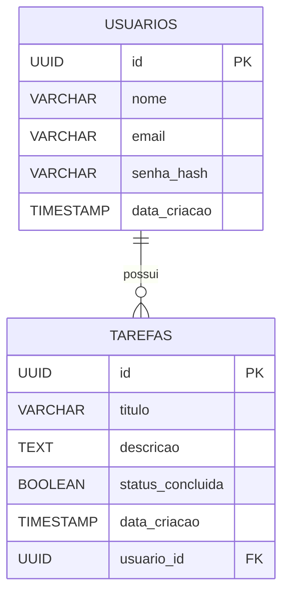

# Gerenciador de Tarefas — Trabalho Final

Sistema web completo de gerenciamento de tarefas (To-Do List) com autenticação JWT.
Cada usuário vê e gerencia somente as próprias tarefas.

## Tecnologias

| Camada | Tecnologia |
|---|---|
| Front-end | HTML5, CSS3, JavaScript (Vanilla) |
| Back-end | Java 21 + Spring Boot 3.2 + Spring Security |
| Autenticação | JWT (jjwt 0.12) |
| Banco de dados | PostgreSQL via Supabase |
| ORM | Spring Data JPA + Hibernate |

---

## Pré-requisitos

- Java 21+
- Maven 3.9+
- Conta no [Supabase](https://supabase.com) com o banco configurado
- Navegador moderno

---

## Como rodar o projeto

### 1. Banco de Dados (Supabase)

As tabelas já foram criadas via migration. Para recriar do zero:

```bash
# Instalar Supabase CLI e autenticar
export SUPABASE_ACCESS_TOKEN="seu_token_aqui"
supabase link --project-ref seu_project_ref
supabase db push
```

O arquivo de migration está em `supabase/migrations/`.

---

### 2. Back-end (Spring Boot)

```bash
# Entrar na pasta do back-end
cd backend

# Definir a senha do banco como variável de ambiente
export SUPABASE_DB_PASSWORD="sua_senha_do_supabase"

# Compilar e iniciar
mvn spring-boot:run
```

O servidor sobe na porta **8080**.

> Para rodar a partir do `.jar` já compilado:
> ```bash
> mvn package -DskipTests
> SUPABASE_DB_PASSWORD="sua_senha" java -jar target/todo-1.0.0.jar
> ```

---

### 3. Front-end

O front-end é composto por arquivos estáticos. Para evitar bloqueios de CORS,
sirva via HTTP (não abra o `.html` diretamente pelo sistema de arquivos):

```bash
# Opção 1 — Python (sem instalar nada extra)
cd frontend
python3 -m http.server 3000
# Acesse: http://localhost:3000

# Opção 2 — Live Server (extensão VS Code)
# Clique em "Go Live" no rodapé do VS Code
# Acesse: http://127.0.0.1:5500
```

---

## Endpoints da API

### Autenticação (público)

| Método | Rota | Descrição |
|---|---|---|
| `POST` | `/api/auth/cadastro` | Cria novo usuário |
| `POST` | `/api/auth/login` | Autentica e retorna o token JWT |

### Tarefas (requer `Authorization: Bearer <token>`)

| Método | Rota | Descrição |
|---|---|---|
| `GET` | `/api/tarefas` | Lista as tarefas do usuário autenticado |
| `POST` | `/api/tarefas` | Cria uma nova tarefa |
| `PUT` | `/api/tarefas/{id}` | Atualiza título e descrição |
| `PATCH` | `/api/tarefas/{id}/status` | Alterna o status (concluída / pendente) |
| `DELETE` | `/api/tarefas/{id}` | Remove a tarefa |

---

## Diagrama Entidade-Relacionamento



> Um usuário pode ter zero ou muitas tarefas.
> Uma tarefa pertence a exatamente um usuário (chave estrangeira `usuario_id`).
> A exclusão do usuário remove em cascata todas as suas tarefas (`ON DELETE CASCADE`).

---

## Estrutura do Projeto

```
ProjetoFinalWeb/
├── supabase/
│   └── migrations/
│       └── 20260611023556_init_todo_schema.sql
├── backend/
│   ├── pom.xml
│   └── src/main/java/com/trabalho/todo/
│       ├── TodoApplication.java
│       ├── controllers/      (AuthController, TarefaController)
│       ├── dto/              (CadastroRequest, LoginRequest, LoginResponse,
│       │                      TarefaRequest, TarefaResponse)
│       ├── models/           (Usuario, Tarefa)
│       ├── repositories/     (UsuarioRepository, TarefaRepository)
│       ├── security/         (JwtUtil, JwtAuthFilter, SecurityConfig,
│       │                      UserDetailsServiceImpl)
│       └── services/         (AuthService, TarefaService)
├── frontend/
│   ├── index.html
│   ├── style.css
│   └── app.js
└── README.md
```
